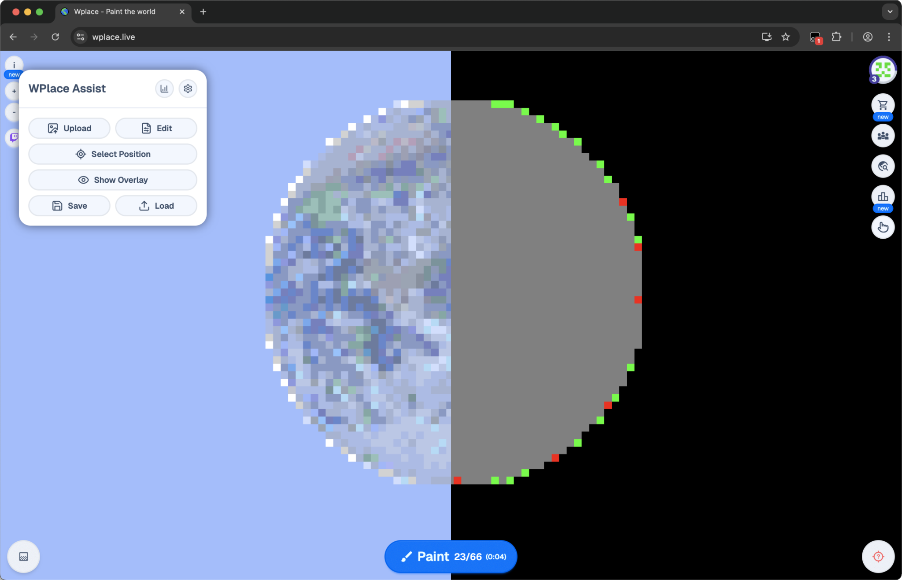
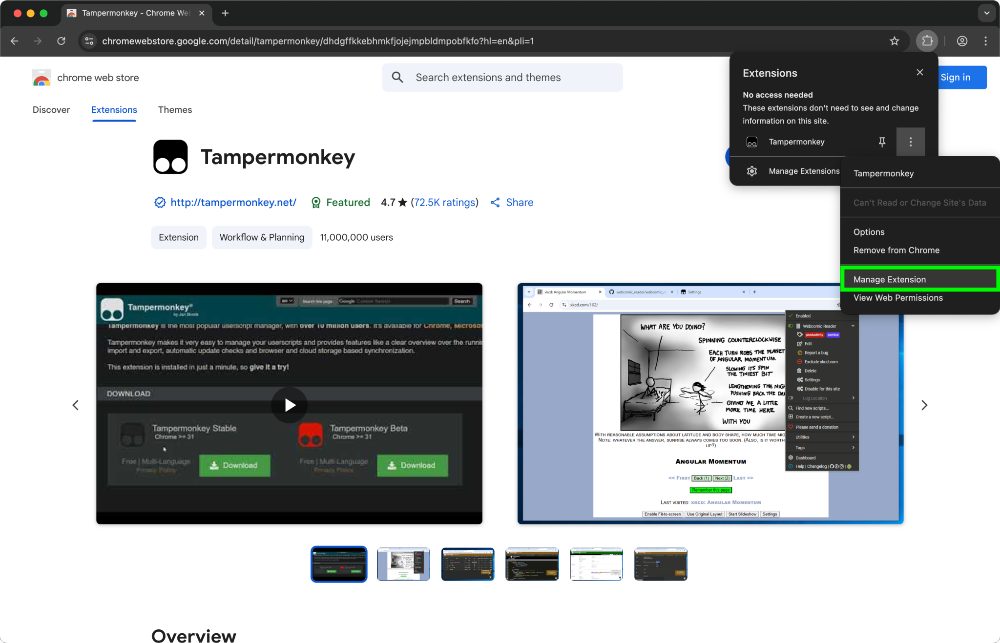
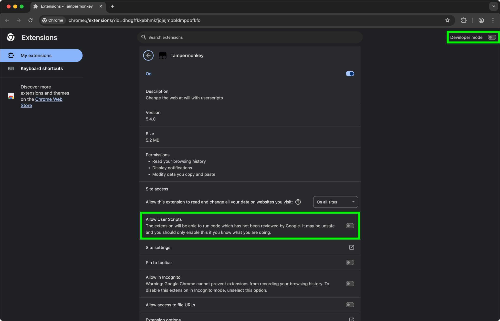

# WPlace-Assist

A userscript for [wplace.live](https://wplace.live/) that makes painting easier by selecting the color automatically for you! WPlace-Assist also supports various image and overlay settings, making progress tracking and repairing easier.

## Installation

WPlace-Assist should work on every browsers that supports [Tampermonkey](https://www.tampermonkey.net/). If it doesn't, please make sure your browser is up to date, as WPlace-Assist relies on some newer browser features.

  
<strong>Install on Chrome</strong>

  
  1. Install the [Tampermonkey](https://chromewebstore.google.com/detail/dhdgffkkebhmkfjojejmpbldmpobfkfo?utm_source=item-share-cb) extension (Tampermonkey is a userscript manager).
  2. Click on the extension and then open the "Manage Extension" page.

  

  3. Enable "Developer Mode" and "Allow User Scripts".

  

  4. Click [this link](https://github.com/LmanTW/WPlace-Assist/releases/latest/download/WPlace-Assist-Tampermonkey.user.js) to install WPlace-Assist directly.
  5. Open or refresh [wplace.live](https://wplace.live).

  
<strong>Install on Firefox</strong>

  1. Install the [Tampermonkey](https://addons.mozilla.org/firefox/addon/tampermonkey) add-on (Tampermonkey is a userscript manager).
  2. Click [this link](https://github.com/LmanTW/WPlace-Assist/releases/latest/download/WPlace-Assist-Tampermonkey.user.js) to install WPlace-Assist directly.
  3. Open or refresh [wplace.live](https://wplace.live).

> [!NOTE]
> WPlace-Assist has not been tested on any mobile devices, so it might not work as expected.

## FAQ

> Q: Does this violate the rules? 
> A: Although I personally don't consider this as botting, there's still a chance that this violates the rules. Judge it yourself, and use it at your own risk.

> Q: How to open WPlace-Assist? 
> A: There's a pointing hand icon on the right side. Click to toggle the Wplace-Assist interface.

> Q: How to use WPlace-Assist? 
> A: When painting, WPlace-Assist will select the color for you after you have submited the pixels. It might take some time for the tiles to update.

> Q: How to set the position of the image? 
> A: Click the "Select Position" button and then click on a pixel where you want to place the image.
